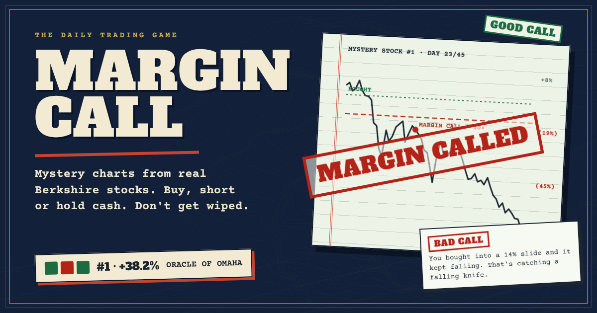

# Margin Call



A trading game on mystery charts from stocks Berkshire Hathaway owns or has owned. Every chart is a real stretch of real daily prices. You don't know the stock or the year until the round ends.

**Play:** https://vane-games.github.io/Margin-call/ (works right inside an X post)

## How it plays

- Hold **BUY** to go long, hold **SHORT** to go short, let go to sit in cash
- Pick your leverage: 2×, 5×, 10× or 25×. At N× a 100/N % move against you is a margin call
- Each trade costs $1 plus 0.05% of the position, so overtrading and small accounts hurt
- A coach grades every move a few days later: **GOOD CALL**, **BAD CALL** or **NO EDGE**, with the reason and a tip
- After each round the stock and dates are revealed, with one money rule worked out from your own trades

## Modes

- **Daily**: the same 3 charts for everyone today, $1K account. Your first run counts. Cash out early or play all 3. You get a percentile ("you beat 74% of today's players") and a share line:
  ```
  Margin Call #12 🟩🟥🟩
  +38.2% at 10× · ORACLE OF OMAHA
  ```
- **Endless**: random charts until you get margin called. Cash out to put your return on the all-time board

## The rules it teaches

| Rule | What the round shows |
|---|---|
| Leverage shrinks your room | The dip before the move liquidates you before you are proven right |
| Losses are asymmetric | A 50% loss needs a 100% gain to get back |
| Chop eats leverage | Flat prices with daily leverage and fees still lose money |
| Size for the worst day | One bad day times your leverage is your real risk |
| What you own decides the hole | In the same crash, one Berkshire holding fell half as far as another |
| Time in beats timing | Miss the 3 best days and most of the gain is gone |

## End-of-run titles

Oracle of Omaha, Steady Compounder, Bagholder, Paper Hands, Overtrader, Cash Hoarder, Leverage Junkie, Wiped Out, Death by Fees.

## Stocks in the game

American Express, Apple, Coca-Cola, Exxon, GE, Goldman Sachs, IBM, Johnson & Johnson, Walmart. 15 real episodes from 2008 to 2017, each cut into random 45-day slices.

## Files

| File | What it is |
|---|---|
| `index.html` | The whole game: one file, no build step, price data embedded |
| `cover.png` | 1200×630 preview for links |
| `cover-square.png` | 1200×1200 preview for the in-post player on X |

## Run locally

Open `index.html` in a browser. That's it. The leaderboard stays offline until you connect Supabase.

## Leaderboard

Uses a free Supabase project and its public REST API. Run the SQL for both tables (`scores` for endless, `daily_scores` for the daily challenge) in the Supabase SQL editor, then put your project URL and publishable key into `window.GAME_CONFIG` near the bottom of `index.html`. Row-level security allows reading the boards and adding scores only.

## Playing inside X

`index.html` carries `twitter:card = player` tags, so a post with the link shows a Play button and the game runs in the timeline. On phones it opens in X's in-app browser.

## Data and disclaimer

Daily prices come from public historical datasets (Yahoo Finance exports). Prices are not adjusted for dividends. This is a game for learning how leverage and risk work. It is not financial advice and is not affiliated with Berkshire Hathaway.
